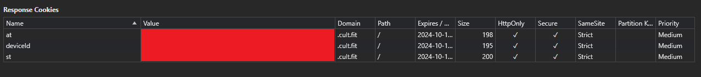

# cult.fit auto booking
Built a small thing to auto book cult group classes. Classes in my preferred centres get booked very quickly and I end up having to go on days that don't want to. 

Auth data is sent via cookies and these can be obtained from dev tools when we login in the browser. We need something called `at`, `st` and `deviceId`. It'll look something like this:

